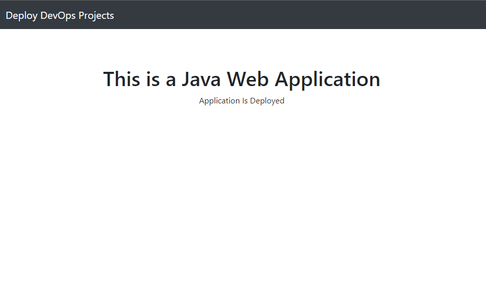

<h4 align="center">springboot-java-project</h4>
<h1 align="center">Hey Everyone 👋, I'm Emmanuel</h1>
<h3 align="center">Here's a devops training project using maven build automation and project management tool and tomcat on linux OS</h3>

## To Build & Run This project, follow the steps.

--> Clone the Project

--> Go to Root directly of the project

--> Run "mvn clean package"

--> Run "java -jar target/jar_file_name.jar"

--> Access the Application at IP:8080

